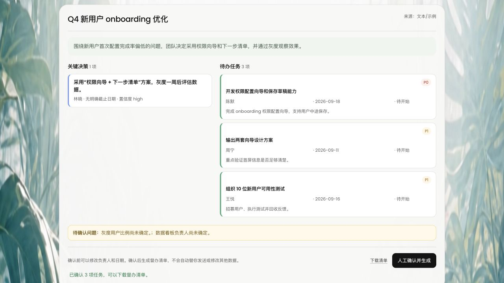
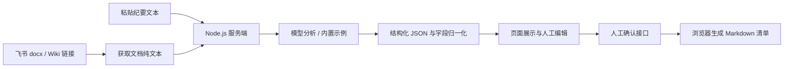

<div align="center">

# MeetingMind

### 让每场会议，都走向行动。

把飞书会议纪要转成 **关键决策、可执行任务和待确认问题**，经人工确认后导出会后督办清单。

**知乎黑客松项目 · 飞书文档 × DeepSeek · 人工确认 · Markdown 导出**

[产品预览](#产品预览) · [快速体验](#快速体验) · [接入真实纪要](#接入真实纪要) · [技术实现](#技术实现) · [常见问题](#常见问题)

</div>


## 为什么做 MeetingMind

会议结束后，团队往往还要再做一轮整理：哪些话只是讨论，哪些已经形成决定？下一步由谁负责，什么时候完成？没有说清楚的事，又该找谁确认？

**MeetingMind 是一个面向会后执行的 AI 会议助理。** 从一份已有纪要出发，它帮助团队梳理结论、拆出任务、暴露信息缺口，让会后跟进有一份清晰的起点。

它适合产品评审、研发周会、项目推进会和运营复盘等场景。项目经理可以快速整理行动项，任务负责人可以核对自己的交付内容，团队也能把尚未达成共识的问题继续带回讨论。

> 当前版本是可运行的黑客松原型：完成「纪要输入 → 结构化分析 → 人工核对 → 清单下载」。这里的“督办”指生成供团队跟进的清单；自动派发、进度追踪和逾期提醒属于后续扩展。

## 产品预览

### 一个入口，接住两种纪要来源

首页支持粘贴飞书文档 / Wiki 链接，也支持直接输入会议纪要文本。输入框左下角的 **＋** 可以填入内置示例，右下角的 **箭头** 用于开始分析。

### 一份结果，把结论、行动和疑问分开



*以上截图来自本地运行的实际页面。结果页使用仓库内置示例模式，展示预设的 1 项决策、3 项任务和 2 个待确认问题，并非一次真实模型调用的效果评测。*

| 能力 | 具体做什么 | 对团队的价值 |
| --- | --- | --- |
| 读取会议纪要 | 支持直接粘贴文本、读取飞书 docx 文档，以及解析指向 docx 的 Wiki 页面 | 以已有协作文档作为输入 |
| 提炼关键决策 | 输出结论、负责人、截止日期和模型给出的置信度字段 | 方便核对哪些内容已形成共识 |
| 拆解执行任务 | 整理任务标题、说明、负责人、截止日期、优先级和关联决策 | 把会后行动集中在一处 |
| 保留信息缺口 | 用 `open_questions` 单独列出尚未明确的问题 | 提醒团队补充确认 |
| 人工核对 | 页面允许编辑任务标题、负责人和截止日期 | 在导出前修正 AI 的理解 |
| 导出督办清单 | 确认后下载包含决策、任务表格和待确认问题的 Markdown 文件 | 便于手动粘贴到飞书文档或分享给团队 |

## 快速体验

代码需要 **Node.js 18+** 的原生 `fetch`；建议使用仍受维护的 Node.js LTS 版本。项目没有第三方 npm 运行依赖，也没有前端构建步骤。

### 1. 下载并启动

```bash
git clone https://github.com/Tao716/zhihu-hackathon.git
cd zhihu-hackathon
cp .env.example .env
npm start
```

按以上步骤启动后，打开 **[http://localhost:3000](http://localhost:3000)**。复制的 `.env.example` 已设置 `PORT=3000`；如果没有 `.env`、也没有设置 `PORT`，服务端默认使用 **8000**。启动日志会打印实际地址。

需要其他端口时，可在 macOS / Linux 下执行：

```bash
PORT=3001 npm start
```

### 2. 不填密钥，先走完一遍交互

1. 点击输入框左下角的 **＋（填入示例）**。
2. 点击右下角的 **箭头（开始分析）**。
3. 查看关键决策、待办任务和待确认问题；尝试修改任务标题、负责人或截止日期。
4. 点击 **人工确认并生成**。
5. 点击 **下载清单**，得到以会议标题命名的 `.md` 文件。

**示例模式只支持内置示例纪要。** 没有配置 `OPENAI_API_KEY` 时，应用返回预设结果；分析自己输入的真实纪要会提示先配置模型。示例模式不调用飞书或模型 API，但页面字体和背景媒体仍会从外部地址加载。

### 3. 看看会后清单长什么样

内置示例围绕「Q4 新用户 onboarding 优化」展开。团队已经决定采用“权限向导 + 下一步清单”，对应行动项如下：

| 优先级 | 任务 | 负责人 | 截止日期 | 状态 |
| --- | --- | --- | --- | --- |
| P0 | 开发权限配置向导和保存草稿能力 | 陈默 | 2026-09-18 | 待开始 |
| P1 | 输出两套向导设计方案 | 周宁 | 2026-09-11 | 待开始 |
| P1 | 组织 10 位新用户可用性测试 | 王悦 | 2026-09-16 | 待开始 |

灰度用户比例、数据看板负责人仍然列在“待确认问题”中。导出的 Markdown 还会包含会议标题、摘要和关键决策；如果你在页面修改了任务字段，导出内容会采用当前值。

## 接入真实纪要

可以分两步接入：**先配置模型并粘贴真实文本，再按需配置飞书文档读取。**

### 配置 AI 分析

编辑项目根目录的 `.env`：

```env
PORT=3000

OPENAI_API_KEY=替换为你的模型服务密钥
OPENAI_BASE_URL=https://api.deepseek.com
OPENAI_MODEL=替换为你的账号可用模型名称

ALLOW_SAMPLE_MODE=false
```

修改配置后重启服务，粘贴会议纪要并开始分析即可。直接分析文本不需要飞书凭证。

服务端调用兼容 OpenAI 格式的 Chat Completions 接口，在 `OPENAI_BASE_URL` 后追加 `/chat/completions`，并请求 `response_format: { "type": "json_object" }`。使用其他服务时，需要确认它同时支持该接口和 JSON 输出模式。

仓库的 `.env.example` 保留了 `deepseek-chat` 配置示例；实际接入时，请以账号可用模型及 [DeepSeek 官方文档](https://api-docs.deepseek.com/) 为准。`OPENAI_BASE_URL` 应填写接口基础地址，不要重复填写 `/chat/completions`。

### 配置飞书读取

1. 在飞书开放平台创建企业自建应用，获取 App ID 与 App Secret。
2. 按所用接口的官方文档配置权限，并完成应用发布 / 授权流程。
3. 确认应用有权访问目标文档；使用 Wiki 时，还需要对应节点的访问权限。
4. 将凭证填入 `.env`，重启服务：

```env
FEISHU_APP_ID=cli_xxx
FEISHU_APP_SECRET=替换为你的应用密钥
```

支持的输入形式：

| 输入 | 处理方式 |
| --- | --- |
| `https://你的租户.feishu.cn/docx/文档token` | 解析文档 token，读取纯文本正文 |
| `https://你的租户.feishu.cn/wiki/节点token` | 先解析 Wiki 节点，再读取其对应的 docx 正文 |
| 直接粘贴会议纪要 | 使用输入文本，无需飞书读取权限 |

API 还支持通过 `document_id` 直接传文档 token。Wiki 节点需要指向 **docx 文档**，当前不支持直接读取表格、多维表等其他节点类型。

对应接口文档：[获取文档纯文本内容](https://open.feishu.cn/document/server-docs/docs/docs/docx-v1/document/raw_content)、[获取知识空间节点信息](https://open.feishu.cn/document/server-docs/docs/wiki-v2/space-node/get_node)。

### 环境变量一览

| 变量 | 用途 | 未设置时的行为 |
| --- | --- | --- |
| `PORT` | HTTP 服务端口 | 服务端默认 `8000`；示例配置为 `3000` |
| `FEISHU_APP_ID` | 飞书自建应用 ID | 无法读取飞书文档；可粘贴文本 |
| `FEISHU_APP_SECRET` | 飞书自建应用密钥 | 与 App ID 配套使用 |
| `OPENAI_API_KEY` | 模型调用密钥 | 允许示例模式时，只能分析内置示例 |
| `OPENAI_BASE_URL` | 模型接口基础地址 | 服务端回退至 `https://api.openai.com/v1`；示例配置使用 DeepSeek |
| `OPENAI_MODEL` | 模型名称 | 服务端回退至 `gpt-4o-mini`；示例配置为 `deepseek-chat` |
| `ALLOW_SAMPLE_MODE` | 是否允许无密钥示例及空输入时使用示例文本 | 默认允许；设为 `false` 可关闭 |

进程环境变量优先于 `.env`。配置了模型密钥后，分析会调用真实模型；`ALLOW_SAMPLE_MODE=true` 不会让已有密钥的请求绕过模型调用。

## 技术实现

### 轻量结构

前端使用原生 HTML、CSS 和 JavaScript，服务端使用 Node.js 原生 HTTP 服务与 `fetch`。一个进程同时提供静态页面和 API，无需数据库即可运行当前演示流程。



### AI 输出约定

完整系统提示词位于 [`server.mjs`](server.mjs) 的 `SYSTEM_PROMPT`。它要求模型只使用纪要明确出现的信息，把不确定内容放入 `open_questions`，日期统一为 `YYYY-MM-DD`，未明确给出的日期留空，并尽量将任务关联到决策。

| 对象 | 主要字段 | 说明 |
| --- | --- | --- |
| 会议 | `meeting_title`、`summary` | 会议标题与摘要 |
| 决策 `decisions[]` | `id`、`content`、`owner`、`deadline`、`confidence`、`source` | 结论、负责人、日期、置信度与原文依据 |
| 任务 `tasks[]` | `id`、`title`、`description`、`owner`、`due_date`、`priority`、`status`、`decision_id`、`source` | 行动项与关联决策；提示词约定优先级为 P0 / P1 / P2、初始状态为待开始 |
| 待确认问题 | `open_questions[]` | 尚未明确的信息 |

服务端会对缺失字段和数组做基础归一化。**这些提示词约定并不等同于事实校验或严格的 JSON Schema 验证**，负责人、时间和优先级仍需要人工核对；`confidence` 也不是经过校准的准确率。

当前 API 结构保留 `source` 和 `decision_id`，但页面与 Markdown 清单尚未展示原文依据或决策关联详情。

### API 说明

| 方法 | 路径 | 用途 |
| --- | --- | --- |
| `GET` | `/api/config` | 返回飞书凭证、模型密钥是否已配置及是否允许示例模式的布尔值，不返回密钥内容 |
| `POST` | `/api/analyze` | 接收 `meeting_text`、`document_url` 或 `document_id`，返回来源信息与结构化结果 |
| `POST` | `/api/confirm` | 接收 `{ "result": ... }`，检查是否有任务，返回 `ok`、`task_count`、`confirmed_at` |

在没有模型密钥、允许示例模式的本地环境中，可以直接体验分析接口：

```bash
curl http://localhost:3000/api/analyze \
  -H 'Content-Type: application/json' \
  -d '{}'
```

空请求会使用内置示例。如果配置了模型密钥，此请求会把示例文本交给真实模型分析。关闭示例模式后，应提供有效文本或文档来源。

`/api/analyze` 返回 `source`、`document_id` 和 `result`。调用 `/api/confirm` 时，将其中的 `result` 作为请求体的 `result` 字段传入。清单由前端生成，项目没有独立的下载 API。

### 目录结构

```text
zhihu-hackathon/
├── public/
│   └── index.html          # 产品页面、交互、任务编辑与 Markdown 导出
├── docs/
│   └── images/             # README 使用的实际产品截图
├── server.mjs              # HTTP 服务、飞书读取、模型调用、提示词与示例
├── .env.example            # 环境变量模板
├── .gitignore              # 忽略本地密钥配置等文件
├── .vefaasignore           # veFaaS 上传排除规则
├── package.json            # npm start 启动脚本
└── README.md
```

## 常见问题

**没有飞书账号或应用，可以体验吗？**

可以。无密钥时使用内置示例；配置模型密钥后可以直接粘贴自己的纪要文本。

**为什么粘贴自己的纪要后提示“当前处于示例模式”？**

没有配置 `OPENAI_API_KEY`。无密钥模式只对内置示例返回预设结果，请配置模型后重启服务。

**飞书链接读取失败怎么办？**

检查 App ID / Secret、应用权限是否生效、应用是否有目标文档的访问权限，以及 Wiki 节点是否指向 docx。只有用户自己能打开链接，并不代表应用也能读取。也可以先复制正文，用文本输入确认模型链路正常。

**模型提示调用失败，或返回内容不是可解析的 JSON？**

检查密钥、基础地址、模型名称及该服务对 JSON 输出模式的支持情况。错误会在页面显示；当前没有自动重试。

**麦克风按钮能录音转写吗？**

当前只提供输入提示，不会录音或转写。可以先使用飞书会议转写，再把文本粘贴进来。

**确认后会自动派发任务或写回飞书吗？**

当前确认接口只校验任务是否非空并返回确认时间；前端随后开放清单下载。它不会创建飞书任务、写回文档或发送消息。

**刷新页面后，结果还在吗？**

当前结果和编辑保留在页面内存中，没有数据库、历史列表或持久化确认记录。请及时下载清单。当前也没有在后续编辑或重新分析后强制重新确认的机制，导出前应再次核对当前内容。

## 当前范围与后续方向

目前已实现：文本 / 飞书文档输入、Wiki 到 docx 的解析、模型结构化分析、内置示例、任务字段编辑、人工确认与 Markdown 导出。

接下来可以围绕实际团队使用补齐：

- **可追溯的结果：** 在页面及导出文件中展示原文依据、任务与决策的关联。
- **持久化与协作：** 保存会议历史、确认版本、任务状态和操作记录。
- **跟进闭环：** 接入飞书任务或文档写回，增加逾期提醒与周报。
- **运行可靠性：** 增加输出校验、超时重试、任务去重和幂等处理。
- **访问控制：** 增加登录鉴权、请求限流、输入大小限制与更细的权限管理。

当前服务没有登录鉴权，不宜直接作为面向公网的生产服务使用。密钥仅在服务端配置，`.env` 已加入 Git 忽略规则；真实分析会将纪要发送到所配置的模型服务，使用前应确认会议内容适合交由该服务处理。
